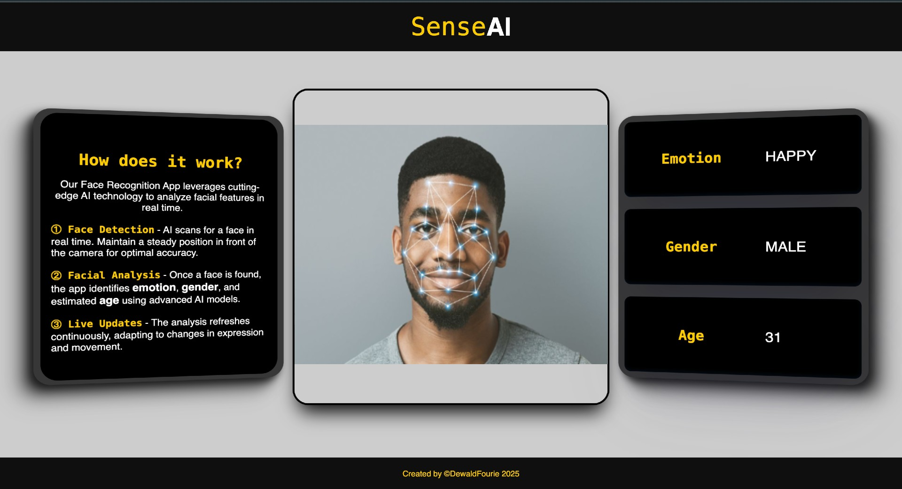

# SenseAI

## Preview


## [Click HERE for DEMO](https://face-recognition-app-pink.vercel.app/)

## Overview

**SenseAI** is a real-time face recognition web application that leverages AI technology to analyze facial features, detect emotions, predict age, and determine gender using a webcam.
This frontend is built using the JavaScript/TypeScript, HTML and CSS & SCSS styling

### Key Features:
- **Face Detection**: Detects a human face in real time & shows warnings if detection fails.
- **Facial Analysis**: Identifies emotion, gender, and estimated age using AI models.
- **Live Updates**: Continuously updates results based on facial expressions and movement.
- **Interactive UI**: Built with CSS and SCSS for a responsive and attractive user interface.

### Tech Stack:
- **Vite** (for fast development and build processes)
- **CSS & SCSS** (for styling)
- **JavaScript & TypeScript** (for logic and AI algorithms)
- **AI Models** (face-api.js)
- **Axios** (for data fetching)
- **Async Functions** (for asynchronous operations)
- **ESLint** (for linting and code quality)

## Installation

1. Clone the repository:

    ```bash
    git clone https://github.com/your-username/SenseAI.git
    cd SenseAI
    ```

2. Install dependencies:

    ```bash
    npm install http-server -g
    ```

3. Run the development server:

    ```bash
    http-server
    ```

The frontend will be available at `http://127.0.0.1:5500/index.html`.

## Usage

- Ensure your device has a working **webcam**.
- Grant camera permissions when prompted.
- The app will detect your face and display real-time results for emotion, gender, and age.


## Code Quality

- **ESLint** is used for maintaining code quality and consistency across the project. Ensure you run linting commands to keep the code clean.

## License

This project is licensed under the MIT License.

## Authors

- [@DewaldFourie](https://github.com/DewaldFourie)

## Contributing

Contributions are welcome! Please feel free to submit pull requests or open issues.

## Contact

For any questions or issues, reach out via GitHub Issues.